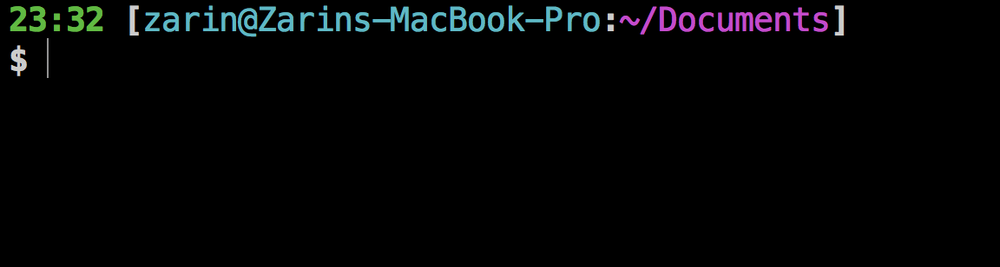

## Customize Bash 

### Overview
Environment: UNIX/Linux

For macOS users, check out this guide: [Deck Out Your Mac Terminal: Part I](https://medium.com/@zarinlo/deck-out-your-mac-terminal-part-i-c8aeab99f561)

In order to customize your shell with aliases, colors, and set a custom prompt, start by adding a `.bashrc` and a `.bash_profile` file. 

The `.bash_profile` is executed for login shells and the `.bashrc` is executed for interactive non-login shells. When you login using a username and password to a server/virtual machine (vm) via ssh or directly on a machine, the `.bash_profile` is executed to configure the shell before the initial command prompt appears. If you have already logged into the server/vm and open a new terminal window, then the `.bashrc` is executed before the command prompt appears. The `.bashrc` is also run when you switch back from another shell (i.e `ksh` or `zsh`) into `bash`. 

### Steps
1. On your server / VM, set bash to be your permanent login shell
``` sh
# set bash as login shell 
chsh -s $(which bash)

# check if your shell changed
cat /etc/passwd | grep $(whoami)
```

2. Clone the two files and place them into your user home directory

```sh
# go into user home
cd ~

# clone repo
git clone https://github.com/zarinlo/custom-bash.git
```

3. Customize your `.bashrc` by adding other aliases or changing up the PS1 (Prompt String 1)

4. Change permissions on the two files and source the `.bash_profile`

``` sh
# make files executable 
chmod u+x .bashrc
chmod u+x .bash_profile 

# execute to configure your shell 
source .bash_profile
```

5. Exit the shell and log back in to see the changes take affect 

6. If you kept the default `.bashrc` provided, you should have the following prompt:



### References
- Bash profile vs bashrc
	- [https://apple.stackexchange.com/questions/51036/what-is-the-difference-between-bash-profile-and-bashrc]( https://apple.stackexchange.com/questions/51036/what-is-the-difference-between-bash-profile-and-bashrc)
- Design a prompt using a generator
	- [http://bashrcgenerator.com](http://bashrcgenerator.com)
	- [https://linuxconfig.org/bash-prompt-basics](https://linuxconfig.org/bash-prompt-basics)
- Colorize your commands 
	- [https://www.howtogeek.com/307899/how-to-change-the-colors-of-directories-and-files-in-the-ls-command](https://www.howtogeek.com/307899/how-to-change-the-colors-of-directories-and-files-in-the-ls-command)
	- [https://askubuntu.com/questions/466198/how-do-i-change-the-color-for-directories-with-ls-in-the-console](https://askubuntu.com/questions/466198/how-do-i-change-the-color-for-directories-with-ls-in-the-console)